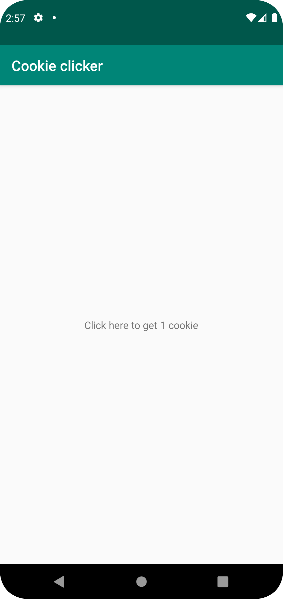

# Rapport

## Följande grundsyn gäller dugga-svar:

-- Viktigt--
Det gick inte att byta git konto, därför var jag tvungen att committa med fel konto
Marcus bad mig skriva detta, mitt inlogg är a20artje

- Jag gick in i strings och ändrade variabel innehåll samt la till en till variabel.
- Jag ändrade vilken variabel som kallades i mitten delen av appen.

Nedan finns de ändrade raderna i:
activity_main.xml
och
strings.xml

```
    ...
    android:text="@string/click_for_cookies"
    ...
    <string name="app_name">Cookie clicker</string>
    <string name="click_for_cookies">Click here to get 1 cookie</string>
    ...
```




Läs gärna:

- Boulos, M.N.K., Warren, J., Gong, J. & Yue, P. (2010) Web GIS in practice VIII: HTML5 and the canvas element for interactive online mapping. International journal of health geographics 9, 14. Shin, Y. &
- Wunsche, B.C. (2013) A smartphone-based golf simulation exercise game for supporting arthritis patients. 2013 28th International Conference of Image and Vision Computing New Zealand (IVCNZ), IEEE, pp. 459–464.
- Wohlin, C., Runeson, P., Höst, M., Ohlsson, M.C., Regnell, B., Wesslén, A. (2012) Experimentation in Software Engineering, Berlin, Heidelberg: Springer Berlin Heidelberg.
